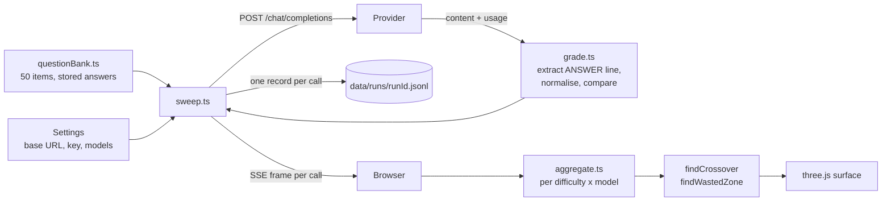
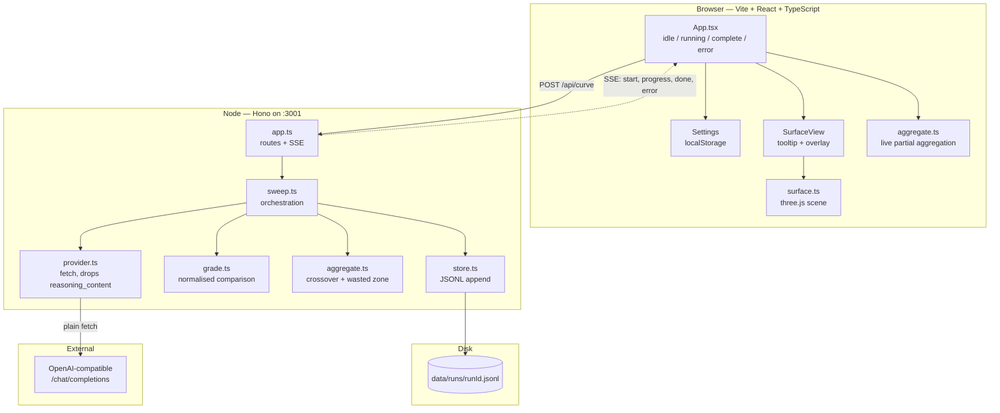
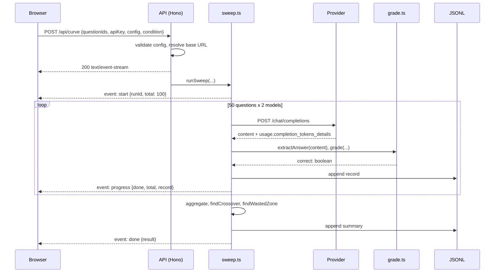

<div align="center">

# The Confidence Curve

**When is the extra thinking worth it?**

A newer model ships. It reasons harder, costs more and is slower. The only question that
matters is where that extra deliberation starts to pay for itself — and where it is just
burning tokens.

This app answers it with a measurement, not an opinion.

[Quick start](#quick-start) · [How it works](#how-it-works) · [Architecture](#architecture) ·
[Verification](#verification) · [Contributing](#contributing)

</div>

---

## What this is

The Confidence Curve runs a fixed bank of **50 questions** (five at each difficulty from 1 to
10) through **two models**, grades every answer **in code** against a stored answer key, and
renders the result as a 3D surface:

- **X** — difficulty, 1 to 10
- **Y** — model (A and B, two distinct ridges)
- **height** — accuracy, 0 to 100%
- **colour** — mean reasoning tokens (cool = few, hot = many)

It then computes and labels the exact difficulty where the newer model's advantage begins and
holds — the **crossover** — and flags the difficulties where it is **hot but flat**: buying more
deliberation for no accuracy.

**What it found on the reference run:**

```
diff   A acc   B acc    gap    A tok    B tok
   1    100%     60%    -40       52      175
   4    100%     60%    -40       88      340
   6     40%     60%    +20      112      540   <- crossover
   8     40%    100%    +60      136     1370   <- hot but flat
  10     40%     80%    +40      160     2920   <- 18x the tokens
```

Below difficulty 6 the newer model is **40 points behind** while spending 4× the reasoning
tokens. Switch reasoning off entirely and it drops **18 points**, falling below the older model
— its advantage was bought with deliberation, not innate. See [VERIFICATION.md](VERIFICATION.md)
for the full evidence and the limits of that claim.

---

## Table of contents

- [Quick start](#quick-start)
- [What it measures](#what-it-measures)
- [How it works](#how-it-works)
  - [The question bank](#the-question-bank)
  - [Grading](#grading)
  - [The model call](#the-model-call)
  - [Streaming](#streaming)
  - [The crossover rule](#the-crossover-rule)
  - [The wasted-compute zone](#the-wasted-compute-zone)
- [Architecture](#architecture)
- [Technology](#technology)
- [The 3D surface](#the-3d-surface)
- [Watching a sweep](#watching-a-sweep)
- [Verification](#verification)
- [Project layout](#project-layout)
- [Contributing](#contributing)
  - [Good first issues](#good-first-issues)
  - [Feature ideas](#feature-ideas)
- [Acceptance criteria](#acceptance-criteria)
- [Notes and limits](#notes-and-limits)
- [Non-goals](#non-goals)

---

## Quick start

```bash
pnpm install
pnpm dev            # API on :3001, web on :5173
```

Open the app, click **Settings**, paste your API key, then press **Sweep · reasoning on**.
When it finishes, press **Sweep · reasoning off** to measure the reasoning tax as a switch.

### Running without an API key

The whole pipeline can be exercised offline against a deterministic stand-in provider:

```bash
pnpm -F server fixture     # a local provider on :3009
pnpm verify                # full offline verification, 26 checks
```

With the fixture running, set **Base URL** to `http://127.0.0.1:3009/v1` in Settings and the app
runs end to end without spending a token. Add `FIXTURE_DELAY_MS=280` to make it respond at a
realistic pace so you can watch the surface fill in.

### From the terminal

```bash
pnpm sweep -- --key sk-...                      # reasoning on
pnpm sweep -- --key sk-... --disable-reasoning  # reasoning off
PARTICLE_API_KEY=sk-... pnpm sweep              # keeps the key out of shell history
```

### If the default ports are taken

Both ports are overridable, and the web app's `/api` proxy follows `API_PORT`:

```bash
PORT=3201 pnpm -F server dev                  # API somewhere else
PORT=5273 API_PORT=3201 pnpm -F web dev       # web, proxying to it
```

This matters more than it looks. If another project already holds :3001, the proxy would happily
forward `/api` to *that* project and the app would quietly show someone else's data. The server
therefore probes its port before binding and refuses to start against a foreign server, printing
the exact commands to fix it:

```
Port 3001 is already in use by a different server.

The web app proxies /api to 127.0.0.1:3001, so it would talk to that
other server instead of this one — and quietly show the wrong data.

  PORT=3201 pnpm -F server dev
  PORT=5273 API_PORT=3201 pnpm -F web dev
```

---

## What it measures

| | |
|---|---|
| **Question bank** | 50 items, 5 per difficulty level 1–10, with stored answers |
| **Categories** | 28 maths, 10 factual recall, 7 multi-step logic, 5 reading comprehension |
| **Grading** | normalised string comparison in code against the stored answer |
| **Recorded per call** | correctness, latency, completion tokens, reasoning tokens, difficulty |
| **Streaming** | server-sent events, one frame per graded call |
| **Audit trail** | every record appended to `data/runs/<runId>.jsonl` |

Reasoning tokens are read from `usage.completion_tokens_details.reasoning_tokens`.
`reasoning_content` is read only to be discarded: it is never logged, stored, or rendered —
only its token count survives the provider boundary.

---

## How it works



### The question bank

The bank is a plain, readable TypeScript array. Every item carries a stored answer **and a note
explaining why that answer is correct**, so the key can be audited without re-deriving each item:

```ts
{
  id: 'q45',
  difficulty: 9,
  category: 'logic',
  question: `A four-digit number N has all of the following properties:
- all four of its digits are distinct;
- the sum of its digits is 18;
- its first digit is exactly twice its last digit;
- it is divisible by 9.

What is the smallest such number?`,
  answer: '2691',
  note: 'The last digit d gives first digit 2d, so d is 1, 2, 3 or 4. With d = 1 the middle '
      + 'two digits must sum to 15, and the smallest leading pair is 6 and 9, giving 2691.',
}
```

A structural self-check runs on every `pnpm verify`:

```ts
export function validateBank(): string[] {
  const problems: string[] = [];
  if (QUESTION_BANK.length !== 50) {
    problems.push(`expected 50 questions, found ${QUESTION_BANK.length}`);
  }
  for (const d of DIFFICULTIES) {
    const n = questionsAtDifficulty(d).length;
    if (n !== QUESTIONS_PER_DIFFICULTY) {
      problems.push(`difficulty ${d} has ${n} questions, expected ${QUESTIONS_PER_DIFFICULTY}`);
    }
  }
  return problems;
}
```

### Grading

Grading is a normalised string comparison in code. **No model ever grades another model**, and
there is no LLM-as-judge path in the codebase.

Two steps: pull the final `ANSWER:` line out of the response, then normalise and compare.

```ts
/** Pull the final `ANSWER: <value>` line out of a response. */
export function extractAnswer(raw: string): string | null {
  // Prefer the last ANSWER: line — the system prompt asks for it to be final,
  // and a model that restates the format earlier should be judged on its last word.
  const matches = [...raw.matchAll(/^\s*ANSWER\s*:\s*(.+?)\s*$/gim)];
  const last = matches.at(-1);
  if (last?.[1]) return last[1].trim();
  return null;
}
```

`normalise()` then strips the surface variation that is not a difference in knowledge — case,
whitespace, punctuation, thousands separators, currency symbols, a leading "the", a trailing
full stop — and `grade()` accepts a match against the stored answer or any declared alias, plus
numeric equivalence so `5.0` matches `5`.

```ts
export function grade(extracted: string | null, expected: string, aliases: string[] = []): boolean {
  if (extracted === null) return false;
  const got = normalise(extracted);
  if (!got) return false;
  const accepted = [expected, ...aliases].map(normalise);
  if (accepted.includes(got)) return true;

  // Numeric equivalence: "5" matches "5.0", "1/7" stays literal.
  const gotNum = toNumber(got);
  if (gotNum !== null) {
    for (const a of accepted) {
      const aNum = toNumber(a);
      if (aNum !== null && Math.abs(aNum - gotNum) < 1e-9) return true;
    }
  }
  return false;
}
```

The verifier unit-tests the grader against 15 hand-written cases, and five of them must be
**rejected**: a wrong number (`16` vs `15`), an off-by-one (`14` vs `15`), a wrong
multiple-choice letter, an empty answer, and a response with no `ANSWER:` line at all.

### The model call

Plain `fetch`. No SDK.

```ts
const body: Record<string, unknown> = {
  model,
  messages: [
    { role: 'system', content: SYSTEM_PROMPT },
    { role: 'user', content: question },
  ],
  temperature: config.temperature,
  max_tokens: maxTokens,
};
if (config.disableReasoning) {
  body['chat_template_kwargs'] = { enable_thinking: false };
}
```

The system prompt is fixed:

> You are a precise assistant. Answer the question directly. End your answer with a final line of
> exactly: `ANSWER: <your answer>`

Three details worth calling out.

**`reasoning_content` is dropped at the boundary.** The response is parsed into a new object
containing only the fields the app needs, so the reasoning text cannot leak into a log, a
record, or the DOM by accident. Only the token count survives.

```ts
// reasoning_content is deliberately dropped here and never referenced again.
const content = typeof message?.['content'] === 'string' ? (message['content'] as string) : '';

return {
  content,
  latencyMs,
  promptTokens: readNumber(usage, 'prompt_tokens'),
  completionTokens: readNumber(usage, 'completion_tokens'),
  reasoningTokens: readReasoningTokens(usage),  // usage.completion_tokens_details.reasoning_tokens
  retried: false,
};
```

**Empty content retries once with a doubled budget**, because the usual cause is the whole
budget being consumed before the answer was emitted:

```ts
const first = await transport.call(model, question, config, config.maxTokens);
if (first.content.trim().length > 0) return first;
const retry = await transport.call(model, question, config, config.maxTokens * 2);
return { ...retry, retried: true, latencyMs: first.latencyMs + retry.latencyMs };
```

**The provider's real error text is surfaced verbatim** rather than paraphrased, so a 401 or a
bad model name reads exactly as the provider wrote it:

```ts
if (!response.ok) {
  throw new ProviderError(
    `HTTP ${response.status} from ${url}\n${truncate(text, 1200)}`,
    response.status,
  );
}
```

### Streaming

`EventSource` cannot POST, so the client posts the sweep and reads the response body directly,
parsing the SSE frames by hand:

```ts
const reader = response.body.getReader();
const decoder = new TextDecoder();
let buffer = '';

while (true) {
  const { done, value } = await reader.read();
  if (done) break;
  buffer += decoder.decode(value, { stream: true });

  // SSE frames are separated by a blank line.
  let boundary = buffer.indexOf('\n\n');
  while (boundary !== -1) {
    const frame = buffer.slice(0, boundary);
    buffer = buffer.slice(boundary + 2);
    boundary = buffer.indexOf('\n\n');
    const data = frame.split('\n')
      .filter((line) => line.startsWith('data:'))
      .map((line) => line.slice(5).trimStart())
      .join('\n');
    if (data) handlers.onEvent(JSON.parse(data) as SweepEvent);
  }
}
```

Four event types flow over the wire:

| Event | Payload |
|---|---|
| `start` | `runId`, `condition`, `total`, redacted config |
| `progress` | `done`, `total`, the full graded record |
| `done` | the complete `CurveResult` |
| `error` | the provider's message |

### The crossover rule

The crossover is the **lowest difficulty at which Model B's accuracy advantage is positive and
stays positive at every higher difficulty**. It is computed from the measured records on every
render — there is no constant anywhere in the code that names a difficulty.

```ts
export function findCrossover(agg: Aggregate): Crossover {
  const gaps = DIFFICULTIES.map((difficulty) => {
    const a = agg.cells.find((c) => c.difficulty === difficulty && c.slot === 'A');
    const b = agg.cells.find((c) => c.difficulty === difficulty && c.slot === 'B');
    return {
      difficulty,
      gap: (b?.accuracy ?? 0) - (a?.accuracy ?? 0),
      aAccuracy: a?.accuracy ?? 0,
      bAccuracy: b?.accuracy ?? 0,
    };
  });

  let crossover: number | null = null;
  for (let i = 0; i < gaps.length; i++) {
    const here = gaps[i];
    if (!here || here.gap <= 0) continue;
    const staysPositive = gaps.slice(i).every((g) => g.gap > 0);
    if (staysPositive) {
      crossover = here.difficulty;
      break;
    }
  }

  return { difficulty: crossover, gaps, none: crossover === null };
}
```

The "stays positive" clause is what stops the rule chasing noise. With five samples per
difficulty a single cell can swing 20 points, so a one-off positive gap is not evidence of
anything.

### The wasted-compute zone

A **marginal-return test on Model B alone**, not a comparison against A. The question is "where
is the extra thinking just burning tokens", and the honest signal for that is B's own token
curve rising while its accuracy curve flattens:

```ts
export const WASTED_TOKEN_GROWTH = 0.25;   // >= 25% more reasoning tokens than the level below
export const WASTED_ACCURACY_GAIN = 5;     // ...for <= 5 points of accuracy

const tokenGrowth = (here.meanReasoningTokens - prev.meanReasoningTokens) / prev.meanReasoningTokens;
const accuracyGain = here.accuracy - prev.accuracy;

if (tokenGrowth >= WASTED_TOKEN_GROWTH && accuracyGain <= WASTED_ACCURACY_GAIN) {
  out.push(difficulty);
}
```

This definition matters. An earlier version compared B against A and flagged the crossover
difficulty itself as "wasted" — even though B was 20 points *ahead* there. Being ahead is not
waste.

---

## Architecture



### Request lifecycle



The API key arrives in the POST body from the browser's localStorage. It is never persisted
server-side, never logged, and never echoed back — `redactConfig()` strips it before any config
is emitted, stored or returned.

### API surface

| Route | Purpose |
|---|---|
| `GET /api/health` | Liveness; reports the bank size, which is also how the port guard identifies itself |
| `GET /api/questions` | The 50-item bank plus bank validation problems |
| `POST /api/curve` | Run a sweep; responds with an SSE stream |
| `GET /api/runs` | List stored runs |
| `GET /api/runs/:runId` | Read a stored run back and re-aggregate it |

---

## Technology

| Layer | Choice | Why |
|---|---|---|
| **Frontend** | React 18 + TypeScript 5.7 | Component model for the panels; types mirror the server shapes |
| **Build** | Vite 6 | Instant HMR, and a dev proxy that keeps the browser same-origin |
| **3D** | three.js r171 | Direct scene control for deterministic 2x PNG export |
| **Backend** | Node 22+ + Hono 4 | Tiny, fast, and `streamSSE` makes server-sent events a one-liner |
| **Transport** | Plain `fetch` | No SDK, so any OpenAI-compatible endpoint works |
| **Runtime TS** | tsx | Run TypeScript directly, no build step in dev |
| **Persistence** | Append-only JSONL | Auditable line by line, diffable in git, no database |
| **Monorepo** | pnpm workspaces | Two packages, one lockfile |

**No** database, no ORM, no auth, no state manager, no component library, no CSS framework, no
LLM SDK. The only runtime dependencies are `hono`, `@hono/node-server`, `react`, `react-dom` and
`three`.

---

## The 3D surface

Two ridges of columns in space — Model A at the back, Model B at the front.

```ts
const ROW_A_Z = -2.4;
const ROW_B_Z = 2.4;
const COLUMN_WIDTH = 1.5;
const ACCURACY_HEIGHT = 8;   // world units for 100%

const height = Math.max(0.06, (cell.accuracy / 100) * ACCURACY_HEIGHT);
const t = normaliseTokens(cell.meanReasoningTokens, min, max);
const colour = rampColor(t);
```

The heat ramp is defined **once**, in `web/src/lib/colour.ts`, and consumed by both the three.js
scene and the HTML legend — so the colour a viewer reads off the legend is the colour they see
in space, and the two cannot drift apart:

```ts
export const RAMP_STOPS = [
  { at: 0.0,  color: '#1d3f5c' },  // deep cool blue — barely thinking
  { at: 0.25, color: '#2f7fa8' },
  { at: 0.5,  color: '#57a86f' },  // neutral green — the middle of the range
  { at: 0.72, color: '#e0a92c' },
  { at: 0.88, color: '#f2701d' },
  { at: 1.0,  color: '#ff3d1f' },  // hot — burning tokens
];
```

Other details:

- **Crossover marker** — a vertical plane plus a floor line at the crossover difficulty, in the
  one signal colour (`#ff4d3d`) reserved exclusively for it.
- **Hover** — a raycast against the column meshes feeds an HTML tooltip with both models'
  accuracies, mean reasoning tokens, mean latency and sample count.
- **Auto-rotate when idle** — `OrbitControls.autoRotate` pauses on interaction and resumes after
  4 seconds of quiet.
- **Export PNG at 2x** — the renderer is temporarily resized, rendered, captured and restored,
  giving a 2520×1740 image from a 1260×870 viewport.

```ts
exportPng(scale: number) {
  const w = container.clientWidth || 1;
  const h = container.clientHeight || 1;
  const previousRatio = renderer.getPixelRatio();
  renderer.setPixelRatio(scale);
  renderer.setSize(w, h, false);
  camera.aspect = w / h;
  camera.updateProjectionMatrix();
  renderer.render(scene, camera);
  const url = renderer.domElement.toDataURL('image/png');
  // Restore the interactive size.
  renderer.setPixelRatio(previousRatio);
  renderer.setSize(w, h, false);
  renderer.render(scene, camera);
  return url;
}
```

---

## Watching a sweep

The surface is built from the records as they stream in, not after the run ends. A sweep of 100
model calls can take minutes, so the viewport fills in live:

- **Unmeasured slots** are drawn as faint outlines — the empty shape of the run is visible from
  the first moment, so the canvas is never blank.
- **Partially measured columns** are translucent with a bright outline. A cell holds five
  samples, so a column is provisional until all five are in; it never shows a half-finished
  number as if it were settled.
- **Finished columns** are solid, with the reasoning-token heat colour.
- The **crossover reads "Measuring…"** during a run. It is genuinely unknown until every higher
  difficulty is measured, so claiming "none" mid-sweep would be wrong.
- The **progress card** reports the live call count, how many of the 20 columns are measured,
  the question currently in flight, and elapsed time.

The browser keeps a running aggregate of the records received so far:

```ts
const liveAggregate = useMemo(
  () => (liveRecords.length > 0 ? aggregate(liveRecords, modelNames) : null),
  [liveRecords, modelNames],
);
```

Because the surface shows provisional data, a stopped or failed sweep leaves visible partial
columns rather than a misleading finished shape — and the run is still recorded to JSONL.

### Making a real sweep finish in reasonable time

A real reasoning model can spend a minute or more on a hard question. Strictly sequential calls
therefore make a 100-call sweep an hour long — and because the counter only moves when a call
*returns*, that reads as a hang. Three things address this:

**Bounded concurrency.** Calls run four at a time by default. Against a provider with a fixed
per-call latency this is close to a 4× speed-up, with identical accuracy and token numbers:

```bash
SWEEP_CONCURRENCY=1 pnpm sweep -- --key sk-...   # strictly sequential, cleanest latency data
SWEEP_CONCURRENCY=8 pnpm sweep -- --key sk-...   # faster, more rate-limit risk
```

Latency is the only measurement that suffers: it is wall-clock per call, so it gets noisier under
load. Accuracy and reasoning tokens are unaffected, and those are what the surface encodes. If you
care about latency, use `SWEEP_CONCURRENCY=1`.

**A finite per-request timeout.** A hung connection can never freeze a sweep forever:

```bash
REQUEST_TIMEOUT_MS=120000 pnpm sweep -- --key sk-...
```

**Per-call logging on the server console.** Every graded call prints one line as it lands, so the
terminal — not the browser counter — is where progress is actually visible:

```
[  1/100] q01 A deepseek-v4-flash-0731  ok       0.3s  52 reasoning tok
[  2/100] q01 B deepseek-v4.1-flash     ok       0.3s  175 reasoning tok
[  3/100] q02 A deepseek-v4-flash-0731  miss     0.3s  52 reasoning tok
[  4/100] q03 B deepseek-v4.1-flash     FAILED  HTTP 429 from https://...
```

A `FAILED` line carries the provider's own error text. A `(retried with doubled budget)` suffix
means the model returned empty content — usually because it spent the whole token budget on
reasoning — and the call was repeated at 2× the budget.

> **After changing any server file, restart the API.** `tsx` does not hot-reload the server, so a
> running process keeps executing the old code until it is restarted.

The browser shows the same thing from its side: while a call is in flight the progress card reads
`waiting on provider · 47s`, so a slow sweep is distinguishable from a frozen one.

---

## Verification

```bash
pnpm verify        # 26/26 checks
```

Runs the full 50-question sweep twice — reasoning on, then off — through the real sweep, grader,
JSONL store, aggregation and crossover code, against a deterministic offline transport whose
competence curve is known in advance.

The results are committed at
[`data/runs/verification-reasoning.jsonl`](data/runs/verification-reasoning.jsonl) and
[`data/runs/verification-noreasoning.jsonl`](data/runs/verification-noreasoning.jsonl).

| Layer | Covers | Status |
|---|---|---|
| **Offline, automated** | Sweep, grader, JSONL, aggregation, crossover, reasoning toggle | 26/26 pass |
| **Browser, automated** | Settings persistence, SSE progress, live surface, tooltips, PNG export | 12/12 + 11/11 pass |
| **Live provider** | Real model behaviour on the real bank | Needs your key |

See **[VERIFICATION.md](VERIFICATION.md)** for the full evidence, the curve tables, five
spot-checked records, and an honest account of what the offline transport does and does not
prove.

**The offline transport is not a model.** It proves the plumbing, the grading, the crossover
arithmetic and the visual encoding. It cannot tell you anything about real model behaviour.

---

## Project layout

```
.
├── data/runs/                  committed JSONL audit trail
├── server/
│   └── src/
│       ├── questionBank.ts     the 50-item bank, with a note per answer
│       ├── grade.ts            extract, normalise, compare — all in code
│       ├── provider.ts         fetch; drops reasoning_content at the boundary
│       ├── sweep.ts            question x model, graded, appended, streamed
│       ├── aggregate.ts        per-cell means, crossover, wasted zone
│       ├── store.ts            JSONL append and read-back
│       ├── app.ts              Hono routes
│       ├── index.ts            bootstrap + port-collision guard
│       ├── mockTransport.ts    deterministic stand-in with known ground truth
│       └── cli/
│           ├── verify.ts       the 26-check verification suite
│           ├── sweep.ts        headless sweep from the terminal
│           └── fixture.ts      local OpenAI-compatible provider for dev
└── web/
    └── src/
        ├── App.tsx             state machine and layout
        ├── lib/
        │   ├── surface.ts      the three.js scene
        │   ├── colour.ts       the heat ramp, shared by scene and legend
        │   ├── aggregate.ts    live partial aggregation
        │   ├── api.ts          SSE client
        │   ├── config.ts       localStorage persistence
        │   └── wasted.ts       wasted-zone rule, mirrored from the server
        └── components/         SurfaceView, Summary, Settings, Bank
```

---

## Contributing

Fork it, run `pnpm install && pnpm dev`, and you have the whole thing locally. There is no
database to seed and no service to stand up — the fixture provider means you can develop the
entire pipeline offline.

### Before you open a PR

```bash
pnpm typecheck     # both packages, no errors
pnpm verify        # 26 checks, all passing
pnpm build         # production bundle builds
```

If your change touches the surface, check it in a real browser — the type checker will not catch
a raycast that misses, or a column that renders at the wrong height.

### Ground rules

1. **Never let a model grade another model.** Grading stays deterministic and in code.
2. **`reasoning_content` must never be logged, stored or rendered.** The verifier asserts this
   against the JSONL; keep it that way.
3. **No hardcoded API keys, ever.** The key comes from localStorage or `PARTICLE_API_KEY`.
4. **The crossover stays computed.** No constant may name a difficulty.
5. **A failed run must not look like a result.** All-fail is an error; partial failure is
   flagged. This is a scientific instrument, not a demo.

### Good first issues

| Task | Where | Why it helps |
|---|---|---|
| Add a `--questions` flag to the CLI sweep | `server/src/cli/sweep.ts` | Run a subset for a cheap smoke test |
| Show `retried` in the record view | `web/src/components/Summary.tsx` | Makes the doubled-budget retry visible |
| Validate `maxTokens > 0` in Settings | `web/src/components/Settings.tsx` | Currently only the server clamps it |
| Keyboard navigation for the tooltip | `web/src/components/SurfaceView.tsx` | Hover-only is not accessible |
| Export the gap table as CSV | `web/src/components/Summary.tsx` | Reviewers want the numbers |

### Feature ideas

**Measurement**
- **Error bars.** Five samples per cell means a cell moves in 20-point steps. Add a Wilson
  interval to each column and render it as a whisker — the honest fix for the biggest weakness
  in the current data.
- **Repeat runs and variance.** Run the same sweep N times and report the spread. This is the
  single most valuable addition to the project.
- **More models on the Y axis.** The surface generalises to any number of ridges; three or four
  models would show a whole family of crossovers.
- **Difficulty calibration.** Instead of hand-assigning difficulty 1–10, measure it — fit
  difficulty from a reference model's pass rate and let the axis be empirical.
- **Token cost in currency.** Multiply reasoning tokens by the provider's per-token price and
  render a second surface in dollars. "Wasted compute" becomes a number someone can act on.
- **Bootstrap confidence on the crossover.** Resample the records and report how often the
  crossover lands on the same difficulty.

**Visualisation**
- **A true interpolated surface** as an alternative to the bar field, with the bar field as a
  toggle.
- **Animated sweep replay.** The live fill already exists; add a scrubber to replay a completed
  run from the JSONL.
- **Difference surface.** Render B − A directly as a single ridge that crosses zero, with the
  zero plane drawn in.
- **VR / WebXR.** The crossover is a shape in space; standing inside it is the natural end point.

**Engineering**
- **Concurrency.** Calls are strictly sequential. A bounded pool (say 4 in flight) would cut a
  real sweep from minutes to seconds. Needs care: some providers rate-limit, and latency
  measurements get noisier.
- **Resumable runs.** Records are already appended per call; a run interrupted at record 60
  could resume rather than restart.
- **Provider adapters.** The transport is already an interface. Add adapters for providers whose
  reasoning-token field lives elsewhere.
- **A `--json` output mode** on the CLI for piping into other tools.
- **Golden-file tests** for the aggregation and crossover, so a refactor cannot silently change
  the arithmetic.

**Product**
- **Shareable permalink** encoding a run's settings, so a result can be reproduced exactly.
- **A compare-two-runs diff view**, rather than the current overlay toggle.

---

## Acceptance criteria

| # | Criterion | Status |
|---|---|---|
| 1 | Grading in code against a stored bank; no model grades another | ✅ `grade.ts`, 15 grader cases pass |
| 2 | Bank visible in the repo, difficulties 1–10, 5 items each | ✅ `questionBank.ts`, shown in the app |
| 3 | Reasoning tokens from `usage.completion_tokens_details.reasoning_tokens` | ✅ `provider.ts` |
| 4 | `reasoning_content` never logged, stored or rendered | ✅ dropped at the boundary; asserted against JSONL and DOM |
| 5 | Reasoning-disabled run produces zero reasoning tokens | ✅ 0 across all 100 calls |
| 6 | Crossover computed from real data, not hardcoded | ✅ `findCrossover()`, no difficulty constant |
| 7 | PNG export readable at 2x | ✅ 2520×1740 from a 1260×870 viewport |
| 8 | Base URL, key and both models editable and persisted | ✅ localStorage, verified across a reload |
| 9 | No API key hardcoded anywhere | ✅ field starts empty; keys never written to run data |

---

## Notes and limits

- **The reasoning toggle is honoured via `chat_template_kwargs: {"enable_thinking": false}`.**
  Whether a given provider actually stops reasoning is the provider's business; the app reports
  the token count it gets back. If the provider ignores the flag, the colour will not collapse,
  and that is itself a finding.
- **One question is one sample.** Five items per difficulty means each cell is a 5-sample
  accuracy, so a single cell moves in 20-point steps. The crossover rule deliberately requires
  the advantage to hold at *every* higher difficulty, which is what keeps it from chasing noise.
- **A run where every call failed is reported as an error, not as a flat curve.** A partial
  failure is shown as a warning above the surface and counted as incorrect.
- **The offline transport is not a model.** It proves the plumbing, the grading, the crossover
  arithmetic and the visual encoding. It cannot tell you anything about real model behaviour —
  only a real sweep with your key can do that.
- **Temperature 0 does not make a provider deterministic.** Repeated live runs may differ.
- **Latency is measured per call and is noisier under concurrency.** With the default
  `SWEEP_CONCURRENCY=4`, several calls are in flight at once, so `latencyMs` includes time spent
  waiting on the provider's own queue. Accuracy and reasoning tokens are unaffected. Use
  `SWEEP_CONCURRENCY=1` if latency is what you are measuring.
- **The JSONL records are appended in completion order, not question order.** With concurrency
  that means a line for `q03` can precede one for `q02`. Each line is self-contained (it carries
  its own `questionId`, `difficulty` and `slot`), so the audit trail is still complete and
  unambiguous — but it is not a sorted file. Records are held in question order in memory, so the
  result and the summary line are stable.

---

## Non-goals

No auth, no database, no deployment, no chat UI, no LLM-as-judge grading, no external APIs or
search. A question bank in, a curve and a JSONL out.